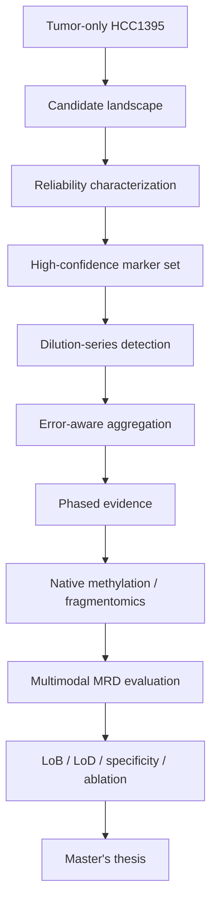
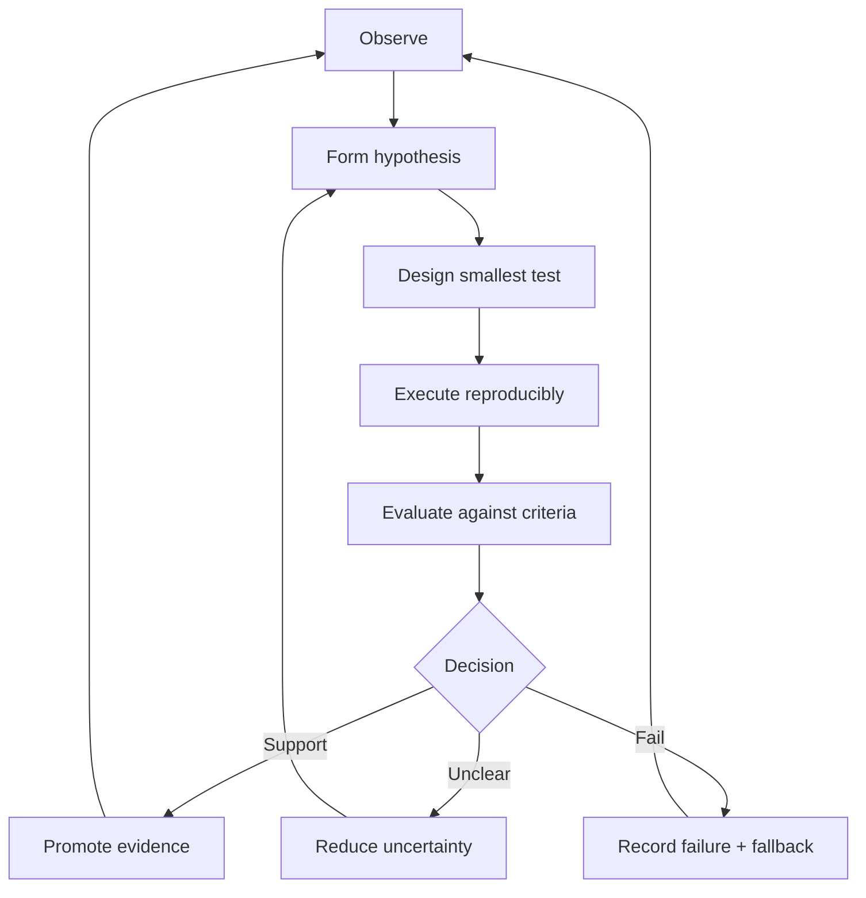

# CODEX PROJECT BRIEF — MRD Long-read Agentic Research Website

> Đọc toàn bộ file này trước khi phân tích hoặc sửa code. Đây là nguồn ngữ cảnh chuẩn cho project.  
> Nhiệm vụ của bạn là xây dựng website, không chỉ trả về kế hoạch hay mockup.

---

## 0. Lệnh khởi động dành cho Codex

Khi nhận file này, hãy thực hiện theo thứ tự:

1. Kiểm tra repository, các file hướng dẫn hiện có, dữ liệu/content hiện có và các thay đổi chưa commit.
2. Tóm tắt ngắn những gì đã có, những gì còn thiếu và các giả định an toàn.
3. Lập implementation plan theo phase, nhưng bắt đầu triển khai ngay Phase 0 và Phase 1 trong cùng phiên làm việc nếu không có blocker thực sự.
4. Tạo website chạy được ở local, bổ sung nội dung MRD ban đầu, kiểm tra build/lint/test và cung cấp lệnh chạy.
5. Không dừng ở việc tạo skeleton trống. MVP phải có nội dung nghiên cứu mẫu đủ để dùng cho weekly report đầu tiên.
6. Không tự ý chạy pipeline bioinformatics nặng, sửa BAM/reference gốc, gửi dữ liệu ra ngoài hoặc cài một hệ thống backend phức tạp.

Prompt ngắn để gọi Codex sau khi đặt file này ở repository root:

```text
Read CODEX_PROJECT_BRIEF_MRD_RESEARCH_OS.md completely and treat it as the canonical project brief. Inspect the repository, then implement Phase 0 and the smallest complete Phase 1. Persist stable project rules in AGENTS.md, keep detailed research context under docs/, build and verify the site, and report evidence of completion rather than only describing intended work.
```

---

## 1. Product definition

Xây dựng một **MRD Long-read Research OS** dưới dạng website: vừa là research notebook có cấu trúc, vừa là nơi tạo weekly report, vừa là evidence trail cho luận văn thạc sĩ.

Website lấy cảm hứng từ ba trang tutorial của CCU Bioinformatics Lab:

- https://ccu-bioinformatics-lab.github.io/lab-tutorial/sr1.html
- https://ccu-bioinformatics-lab.github.io/lab-tutorial/sr2.html
- https://ccu-bioinformatics-lab.github.io/lab-tutorial/sr2b.html

Không sao chép nguyên giao diện hoặc nội dung. Hãy giữ logic trình bày mạnh của chúng:

1. Learning/research objective
2. Why it matters
3. Concept and interactive explanation
4. Real data and evidence
5. Prediction before result inspection
6. Result interpretation
7. Learning/research check
8. Open questions
9. Sources, glossary and page table of contents

Khác biệt quan trọng: ba trang mẫu là tutorial tuyến tính; website mới phải là hệ thống nghiên cứu cập nhật được hàng tuần, liên kết được paper → hypothesis → experiment → result → decision → thesis contribution.

### North-star outcome

Sau mỗi tuần, người dùng phải có thể dùng website để trả lời năm câu hỏi:

1. Tuần này tôi đang giải quyết research question nào?
2. Vì sao câu hỏi đó quan trọng với MRD long-read?
3. Tôi đã kiểm tra hypothesis bằng dữ liệu và metric nào?
4. Evidence nói gì, chưa nói được gì, và có uncertainty nào?
5. Quyết định tiếp theo là gì; nếu nhánh A thất bại thì nhánh B là gì?

Nếu website không giúp trả lời năm câu này thì feature đó chưa có giá trị nghiên cứu.

---

## 2. User context — phải giữ đúng

### Academic background

- Người dùng là học viên Master's ngành CSIE tại Đài Loan, làm việc trong bối cảnh CCU Bioinformatics Lab/lab 405.
- Background chính là Software Engineering; từng làm Java/Spring, cloud, infrastructure và PaaS.
- Người dùng mới bước vào bioinformatics và chưa có nhiều kinh nghiệm conduct research.
- Còn ba học kỳ để hoàn thành chương trình; mục tiêu là tốt nghiệp đúng hạn, theo nhịp **slow and steady**, không mở scope vô hạn.
- Weekly report cho giáo sư là deliverable tối thiểu bắt buộc. Nội dung report phải thể hiện research reasoning, không phải engineering task log.

### Career direction

- Sau Master's: nhắm tới Java/Backend Developer rồi tiến dần sang Cloud Engineer; đồng thời muốn xây nền tảng Data Engineering và Agentic Engineering.
- Website được phép tạo cơ hội học cloud/backend/data engineering, nhưng chỉ ở vai trò hỗ trợ research reproducibility và portfolio.
- Không hy sinh thesis progress để xây microservice, orchestration hoặc infrastructure không cần thiết.

### Priority rule

Khi có xung đột:

1. Weekly research evidence
2. Master's thesis progress
3. Reproducibility và data provenance
4. Agentic automation
5. Cloud/backend/data-engineering enrichment
6. UI polish không ảnh hưởng nội dung

### Deprecated context — không được dùng

Không sử dụng proposal cũ về **“Scale-out haplotype phasing with N50-preserving seam-stitching”**, sharding, seam-stitching, N50 hoặc switch-rate làm hướng thesis hiện tại.

---

## 3. Canonical research context

### Current domain

- Topic: Minimal/Measurable Residual Disease (MRD) bằng long-read sequencing.
- Starting point: reproduce và phân tích các concept từ nghiên cứu **“Genome-wide cell-free DNA mutational integration enables ultra-sensitive cancer monitoring”**.
- Current workstream: **tumor-only HCC1395 candidate characterization**.
- Intended project direction: tumor-only first; không thiết kế workflow phụ thuộc matched normal ngay từ đầu.
- Long-term direction: từ high-confidence tumor markers đến low tumor-fraction detection, sau đó đánh giá phased long-read evidence, native methylation và multimodal evidence.

### Current dataset and environment

- Tumor BAM, read-only:
  `/big8_disk/data/HCC1395/ONT_5khz_simplex_5mCG_5hmCG/HCC1395.bam`
- BAM index `.bai` đã có.
- Reference:
  `/big8_disk/ref/GRCh38_no_alt_analysis_set.fasta`
- Platform: ONT R10, 5 kHz simplex, basecalling có `5mCG_5hmCG`.
- Alignment: `minimap2 -ax map-ont`.
- Approximate coverage hiện được ghi nhận: khoảng 85–100x; PASS SNV mean depth khoảng 80x; chr1:20–25 Mb bằng `samtools coverage` khoảng 101x.
- Somatic caller: ClairS-TO v0.5.0, với model ONT R10 Dorado SUP 5 kHz phù hợp. Tên model đầy đủ phải lấy từ execution manifest/log, không được đoán.
- Dilution series có sẵn/được định hướng sử dụng: 1%, 0.1%, 0.01%.

### Preliminary observations — chưa coi là kết luận sinh học

- ClairS-TO total candidates: `3,169,996`.
- PASS SNVs: `48,819`.
- PASS subset: khoảng `1.54%` tổng candidates.
- Median/typical VAF observation được nhắc tới: khoảng `46%` alternate-read support.
- Middle 50% depth observation được nhắc tới: khoảng `59–106x`.

Website phải gắn nhãn các số trên là `preliminary`, ghi source/provenance và yêu cầu verification từ output thật trước khi dùng làm thesis claim.

### Current research question

> What does the tumor-only candidate landscape look like, and which evidence is sufficient to promote a candidate into a reliable tumor marker without matched-normal dependency at discovery time?

### Current Week-1 boundary

Week 1 tập trung đóng gói candidate landscape:

- Total candidates so với PASS set
- VAF distribution
- Read-depth distribution
- Alternate support
- Filter/tag composition
- Ý nghĩa và giới hạn của từng observation

Không để high-VAF investigation chiếm storyline chính của Week 1. High-VAF calls có thể được ghi thành open question cho phase sau: clonal somatic, residual germline, LOH/CNA hay technical effect.

### Research roadmap, không phải kết luận đã chứng minh



Matched normal hoặc truth set có thể được dùng cho **retrospective validation/benchmarking** nếu có, nhưng không được lén biến nó thành điều kiện bắt buộc của discovery pipeline tumor-only.

---

## 4. Paper corpus và vai trò trong research map

Khởi tạo Literature Matrix với ít nhất các tài liệu sau. Nếu PDF chưa có trên server, tạo metadata và summary dưới đây, đánh dấu `pdf_available: false`; không bịa thêm chi tiết. Khi người dùng copy PDF vào repo hoặc data mount, cập nhật provenance.

| Local filename | Paper/document | Vai trò trong research map |
|---|---|---|
| `nihms-1691964.pdf` | Genome-wide cell-free DNA mutational integration enables ultra-sensitive cancer monitoring | Baseline của breadth-over-depth và genome-wide integration; liên kết nhiều somatic signals để theo dõi low TF/MRD. |
| `Genome Res.-2025-Chen-gr.279144.124.pdf` | Nanopore-based consensus sequencing enables accurate multimodal tumor cell-free DNA profiling | NanoRCS; long-read consensus và kết hợp SNV, CNA, fragmentomics; cầu nối sang multimodal TF estimation. |
| `cfDNA-methyl-profile-requirements-document-en-6.pdf` | Updated method for cfDNA methylation profiling | Cảnh báo pre-analytical/library-prep bias và read-end methylation loss; yêu cầu QC/trimming/protocol provenance. |
| `EMMM-15-e17282.pdf` | Real-time analysis of the cancer genome and fragmentome from plasma and urine cfDNA using nanopore sequencing | Giá trị về speed/deployability, CNA và fragmentomics bằng ONT; supporting evidence cho long-read liquid biopsy. |
| `s41467-024-50850-8.pdf` | DNA methylation and gene expression as determinants of genome-wide cfDNA fragmentation | Liên kết methylation, expression và fragmentation; cơ sở sinh học cho multimodal evidence nhưng cũng cảnh báo các signal không độc lập đơn giản. |
| `download.pdf` | Analytical validation of a ctDNA assay using PhasED-Seq for residual disease in B-cell malignancies | Phased variants, blank samples, dilution series, FPR/background error, LoD và precision; mẫu cho validation framework. |
| `nihms-2005923.pdf` | Ultrasensitive plasma-based monitoring of tumor burden using machine learning-guided signal enrichment | MRD-EDGE; ML-guided signal enrichment, SNV/CNV, và plasma-only monitoring; đối chiếu cho tumor-only/tumor-naive direction. |

Không chỉ viết summary theo paper. Với mỗi paper, cần lưu:

- Problem
- Cohort/sample type
- Sequencing modality
- Tumor-informed, tumor-naive hay hybrid
- Input data
- Signal modalities
- Core method
- Error-control strategy
- Validation design
- Metrics
- Reported strengths
- Assumptions
- Limitations
- Reusable module
- Module that cannot be transferred directly to current data
- Candidate improvement/replacement using lab data/tools
- Evidence level: reported / reproduced / locally validated / rejected

---

## 5. Agentic research operating model

Website phải ép research loop sau thành workflow nhìn thấy được:



### Required object relationships

Mỗi research object phải có ID ổn định và link chéo:

- `RQ-*`: research question
- `HYP-*`: hypothesis
- `PAPER-*`: literature evidence
- `DATA-*`: dataset
- `TOOL-*`: tool/model
- `EXP-*`: experiment
- `RUN-*`: execution run
- `RESULT-*`: result/figure/table
- `DEC-*`: decision
- `RISK-*`: limitation/risk
- `WEEK-*`: weekly report

Ví dụ:

`RQ-001 → HYP-001 → EXP-001 → RUN-001 → RESULT-001 → DEC-001 → WEEK-001`

Không cho phép result “mồ côi” mà không biết nó đến từ dataset, config và run nào.

### Evidence states

- `planned`
- `running`
- `observed`
- `verified`
- `rejected`
- `blocked`

Không dùng từ “proved” chỉ từ một experiment. Phân biệt rõ:

- Observation
- Interpretation
- Biological claim
- Engineering claim
- Remaining uncertainty

### Failure-first logging

Mỗi experiment phải có:

- Expected result trước khi chạy
- Success criteria
- Failure criteria
- Fallback A/B
- Actual outcome
- Why the result may be misleading
- Decision: continue / revise / stop / escalate

Negative result không bị xóa; nó là evidence cho thesis reasoning.

---

## 6. Information architecture

### 6.1 Dashboard

Hiển thị ngay:

- Current research question
- Current hypothesis
- This week's evidence goal
- Current blockers
- Latest verified result
- Next decision
- Thesis milestone status
- Weekly report readiness checklist

Dashboard không phải productivity dashboard chung chung. Không thêm habit tracker, tài chính hoặc social features.

### 6.2 Research Roadmap

Ba tầng:

1. Research logic roadmap: candidate landscape → marker reliability → dilution detection → multimodal evaluation.
2. Graduation roadmap: ba học kỳ còn lại.
3. Current 4–6 week rolling plan.

Mốc tham chiếu:

- Term A: literature map, data inventory, reproducible baseline, narrow thesis question.
- Term B: method/benchmark development, dilution experiments, error model, ablations.
- Term C: validation, thesis figures, writing, defense preparation.

Không hard-code ngày học kỳ nếu chưa có dữ liệu. Cho phép cấu hình trong content file.

### 6.3 Weekly Reports

Có index theo tuần và status. Mỗi trang tuần bắt buộc có:

1. One-sentence research question
2. Why this matters to thesis/MRD
3. Prior knowledge from papers
4. Hypothesis/prediction made before analysis
5. Dataset and configuration
6. Evidence generated this week
7. Observation vs interpretation
8. What the evidence does **not** establish
9. Failure/uncertainty/blocker
10. Decision and next smallest test
11. Three-slide-ready summary
12. Speaker notes

Thêm nút/print style để xuất một weekly page thành PDF bằng browser print. Không cần tự động tạo PPTX trong MVP.

### 6.4 Literature Matrix

Các view:

- Comparison table
- Paper detail
- Concept clusters
- Module transfer map
- Contradictions/gaps

Concept cluster ban đầu:

- Breadth vs depth
- Tumor-informed vs tumor-naive/tumor-only
- SNV evidence aggregation
- Phased variants
- CNA
- Fragmentomics
- Native methylation
- Error suppression / ML enrichment
- LoB / LoD / specificity / precision

### 6.5 Research Questions & Hypotheses

Hiển thị hierarchy, evidence for/against, open assumptions và status. Không biến thành generic Kanban.

### 6.6 Experiments & Runs

Phân tách:

- Experiment design = câu hỏi, hypothesis, protocol, metric, success criteria.
- Run = execution cụ thể với timestamp, command, tool version, parameters, input fingerprints, environment, logs và outputs.

Website chỉ lưu metadata/link, không copy BAM/FASTQ/VCF lớn vào source repository.

### 6.7 Results & Evidence

Hỗ trợ:

- Figure
- Table
- Metric card
- Interpretation
- Caveat
- Link tới run và weekly report

Figure phải có caption gồm: question, cohort, denominator, filter, metric definition và takeaway.

### 6.8 Data & Tool Inventory

Cho từng item:

- Path/location
- Read-only status
- Owner/source
- Reference build
- Sample type
- Platform/basecaller
- Coverage
- Known limitations
- Last verified date
- Checksum/fingerprint nếu hợp lý

Không hiển thị secrets, token hoặc credential.

### 6.9 Decision & Failure Log

Ghi lại:

- Decision
- Evidence used
- Alternatives considered
- Reason rejected
- Revisit trigger
- Impact on thesis scope

### 6.10 Thesis Contribution Map

Mỗi candidate contribution cần có:

- Claim
- Why novel/useful
- Baseline paper/tool
- Required evidence
- Current evidence strength
- Missing experiment
- Risk level

Không gắn nhãn “contribution” chính thức trước khi có comparative evidence.

### 6.11 Engineering Track

Trang này phải nhỏ và phụ thuộc research milestones, gồm:

- Reproducible container
- Static deployment
- CI quality gates
- Data manifest/provenance
- Optional workflow orchestration
- Optional API/database only when justified

Mỗi task engineering phải trả lời: “Nó tiết kiệm thời gian nghiên cứu nào hoặc tăng độ tin cậy nào?” Nếu không trả lời được, đưa vào backlog.

---

## 7. MVP content to ship

MVP phải có nội dung thật, không dùng lorem ipsum:

### `WEEK-001` — Tumor-only candidate landscape

- Question: What does the tumor-only candidate landscape look like?
- Inputs: HCC1395 tumor-only BAM, GRCh38 no-alt reference, ClairS-TO output.
- Preliminary funnel: 3,169,996 total candidates → 48,819 PASS SNVs (~1.54%).
- Plots/placeholders backed by data schema:
  - candidate filter funnel
  - VAF distribution
  - depth distribution
  - VAF vs depth scatter/hexbin
  - filter/tag composition
- Interpretation boundary:
  - PASS means passes caller criteria; không đồng nghĩa tất cả là confirmed somatic.
  - 46% alternate support cho thấy peak gần heterozygous-like range, nhưng tự nó không phân biệt clonal somatic với residual germline hoặc copy-number/LOH effects.
  - depth 59–106x cho biết phần giữa distribution có read support tương đối mạnh cho characterization; nó không đảm bảo sensitivity ở dilution thấp.
  - 1.54% là selection funnel, không phải false-positive rate của 98.46% bị loại.
- Next decision: xác định evidence ladder để đánh giá reliability mà vẫn giữ tumor-only discovery.

### Initial research objects

- `RQ-001`: Tumor-only candidate landscape and marker reliability.
- `HYP-001`: PASS + adequate depth/support narrows technical noise but is insufficient to establish somatic status.
- `EXP-001`: Characterize candidate-count, VAF, depth, ALT support and tags.
- `DEC-001`: Do not rescue filtered calls with ML before a truth/benchmark framework exists.
- `RISK-001`: PASS interpreted incorrectly as true somatic.
- `RISK-002`: High coverage in source tumor sample confused with low-TF detection capability.

---

## 8. Content model

Ưu tiên Markdown/MDX + YAML frontmatter, version-controlled và human-readable.

Ví dụ weekly report:

```yaml
---
id: WEEK-001
title: Tumor-only candidate landscape
period: "YYYY-Www"
status: observed
research_questions: [RQ-001]
hypotheses: [HYP-001]
experiments: [EXP-001]
results: [RESULT-001]
decisions: [DEC-001]
evidence_level: preliminary
last_verified: null
---
```

Ví dụ run manifest:

```yaml
id: RUN-001
experiment_id: EXP-001
status: planned
inputs:
  - id: DATA-HCC1395-TUMOR-BAM
    path: /big8_disk/data/HCC1395/ONT_5khz_simplex_5mCG_5hmCG/HCC1395.bam
    read_only: true
reference:
  path: /big8_disk/ref/GRCh38_no_alt_analysis_set.fasta
tool:
  name: ClairS-TO
  version: 0.5.0
  model: VERIFY_FROM_RUN_LOG
command_file: null
started_at: null
completed_at: null
outputs: []
```

Schema validation phải bắt được:

- Duplicate ID
- Broken cross-reference
- Missing required frontmatter
- Result không có experiment/run
- Verified result không có provenance
- Claim không có evidence link

---

## 9. Technical architecture

### MVP stack — static first

Ưu tiên:

- Astro
- TypeScript strict mode
- MDX content collections
- Tailwind CSS hoặc CSS system nhỏ, nhất quán
- React/Svelte island chỉ cho interaction cần thiết
- Mermaid cho research flow
- Plotly/ECharts/Vega-Lite cho chart tương tác nếu dữ liệu đủ nhỏ
- Vitest cho logic/schema; Playwright cho critical navigation nếu phù hợp

Lý do: tutorial/research notebook là content-heavy và deploy static tốt. Không dựng Spring Boot, microservices hoặc database trong MVP.

Nếu repository đã có stack phù hợp và chạy tốt, ưu tiên mở rộng stack hiện có thay vì rewrite. Ghi lại quyết định.

### Future-ready boundary

Thiết kế adapter/interface để sau này có thể thêm:

- FastAPI lightweight service cho ingest/query khi static content không đủ
- PostgreSQL cho structured experiment registry
- S3-compatible object storage cho artifact nhỏ/manifest/export
- Workflow engine cho scheduled/reproducible runs

Chỉ triển khai khi có use case thật và migration plan. File BAM/FASTQ/VCF lớn vẫn ở server/HPC/object storage, không qua web app.

### Deployment

- Local development trước.
- Docker multi-stage build tùy chọn nhưng nên có nếu không làm phức tạp workflow.
- Static output phải deploy được lên Cloudflare Pages.
- Không buộc Cloudflare-specific service trong MVP.
- Có CI chạy schema validation, lint, test và build.

### Security and privacy

- Không commit patient-identifiable data, credentials, raw genomics data hoặc private server details ngoài các path kỹ thuật đã được cho phép trong brief.
- Không upload dữ liệu nghiên cứu ra dịch vụ bên ngoài.
- Sanitize command output trước khi publish.
- Public build không được expose absolute server path; path đầy đủ chỉ hiển thị trong local/private mode hoặc được redact.

---

## 10. Suggested repository structure

```text
/
├── AGENTS.md
├── README.md
├── docs/
│   ├── USER_CONTEXT.md
│   ├── RESEARCH_SCOPE.md
│   ├── ARCHITECTURE.md
│   ├── DATA_GOVERNANCE.md
│   └── DECISIONS.md
├── site/
│   ├── src/
│   │   ├── components/
│   │   ├── layouts/
│   │   ├── pages/
│   │   ├── content/
│   │   │   ├── weeks/
│   │   │   ├── papers/
│   │   │   ├── questions/
│   │   │   ├── hypotheses/
│   │   │   ├── experiments/
│   │   │   ├── runs/
│   │   │   ├── results/
│   │   │   ├── decisions/
│   │   │   └── glossary/
│   │   └── styles/
│   ├── public/
│   └── tests/
├── research/
│   ├── manifests/
│   ├── schemas/
│   ├── scripts/
│   ├── notebooks/
│   └── outputs/
│       └── README.md
└── .github/workflows/
```

Nếu repo hiện tại có convention khác, điều chỉnh structure nhưng giữ separation giữa source content, experiment metadata và heavy outputs.

### `AGENTS.md` policy

Codex phải tạo/cập nhật repository-level `AGENTS.md` ngắn gọn, chứa các rule bền vững:

- Thesis-first priority
- Canonical research direction
- Deprecated proposal
- Read-only data rule
- Commands build/test/lint
- Content/provenance requirements
- Definition of done

Context dài phải nằm trong `docs/`, không nhồi toàn bộ brief vào `AGENTS.md`. Codex đọc `AGENTS.md` khi bắt đầu phiên; vì vậy đây là cơ chế chống mất context giữa các account/session.

---

## 11. UX and visual direction

- Ngôn ngữ mặc định: English cho thuật ngữ khoa học và nội dung có thể trình bày; UI labels có thể English. Cho phép ghi chú tiếng Việt khi học/giải thích.
- Desktop-first nhưng responsive.
- Phong cách: scientific notebook, clean, restrained, high information density.
- Có sticky page table of contents cho trang dài.
- Có callout phân biệt:
  - Observation
  - Interpretation
  - Claim
  - Caveat
  - Decision
- Có provenance badge: Preliminary / Verified / Reproduced / External report.
- Có breadcrumb và previous/next research module.
- Các chart phải có denominator, units, sample/filter context và accessible text summary.
- Không dùng animation trang trí nặng, glassmorphism quá mức hoặc dashboard card dày đặc.

Các interaction nên ưu tiên:

- Toggle observation vs interpretation
- Expand assumptions/limitations
- Compare paper methods side-by-side
- Filter literature by modality/design
- Trace evidence graph
- Reveal prediction trước khi hiện result
- Print weekly report cleanly

---

## 12. Weekly working rhythm encoded by the site

Website nên hỗ trợ nhịp tối thiểu:

### Early week

- Chọn một research question nhỏ.
- Đọc/so sánh 2–4 nguồn liên quan.
- Viết hypothesis và prediction trước khi chạy.

### Midweek

- Chạy smallest informative experiment.
- Ghi manifest, config, output và failure.
- Tạo tối đa 1–3 figures có ý nghĩa.

### End week

- Tách observation khỏi interpretation.
- Ra decision và fallback.
- Đóng gói weekly page + three-slide summary.

Time allocation guideline, có thể cấu hình:

- 70%: thesis research/evidence
- 20%: reproducibility, automation và website maintenance trực tiếp phục vụ research
- 10%: transferable cloud/backend/data-engineering learning

Không biến tỷ lệ này thành time tracker bắt buộc.

---

## 13. Implementation phases

### Phase 0 — Repository grounding

Deliverables:

- Repo inventory
- Existing stack decision
- `AGENTS.md`
- `docs/USER_CONTEXT.md`
- `docs/RESEARCH_SCOPE.md`
- Architecture decision record cho static-first approach

### Phase 1 — Smallest complete Research OS

Deliverables:

- Working site shell/navigation
- Dashboard
- Roadmap
- Literature Matrix với 7 nguồn ban đầu
- `WEEK-001` đầy đủ
- Research-question/hypothesis/experiment/decision pages
- Content schema validation
- Print stylesheet
- README với local commands
- Successful lint/test/build

### Phase 2 — Reproducible evidence ingestion

Chỉ sau khi Phase 1 ổn định:

- Script nhận CSV/TSV/JSON summary nhỏ từ analysis outputs
- Generate chart-ready data
- Run manifest validation
- Figure provenance
- Không đọc toàn bộ BAM từ web build

### Phase 3 — Agentic loop support

- “Create next experiment” template từ decision
- Failure/fallback branching
- Evidence graph
- Automated weekly completeness check
- Optional report export improvements

### Phase 4 — Engineering enrichment

Chỉ triển khai theo pain point thật:

- Containerized build
- CI/CD
- Cloudflare Pages preview/deploy
- Optional lightweight API/database/object storage
- Observability cho deployment

---

## 14. Acceptance criteria

MVP chỉ được coi là hoàn thành khi:

- [ ] Website chạy bằng documented local command.
- [ ] Production build thành công.
- [ ] Không có broken internal links trong critical paths.
- [ ] Dashboard chỉ ra được current question, evidence, blocker và next decision.
- [ ] `WEEK-001` có storyline hoàn chỉnh và không biến thành task log.
- [ ] Bảy paper/document có entry trong Literature Matrix.
- [ ] Các preliminary number có provenance label và caveat.
- [ ] Research object IDs link được từ question đến decision/week.
- [ ] Schema validator bắt được broken references.
- [ ] Có print-friendly weekly report.
- [ ] Heavy genomic data không được copy vào repository.
- [ ] BAM/reference source được giữ read-only.
- [ ] `AGENTS.md` lưu các rule bền vững cho session/account khác.
- [ ] README ghi rõ build/test/lint/content-authoring workflow.
- [ ] UI được kiểm tra ở desktop và mobile viewport.
- [ ] Không có placeholder lorem ipsum hoặc claim sinh học bị bịa.

### Definition of done cho mỗi Codex task

Mỗi lần sửa website, Codex phải báo:

1. Outcome đã đạt
2. Files thay đổi
3. Test/build đã chạy và kết quả
4. Assumptions hoặc scientific content chưa verify
5. Next smallest useful step

Không báo “done” nếu chỉ tạo file mà chưa verify build/behavior.

---

## 15. Non-goals và chống overengineering

Không làm trong MVP:

- Full laboratory information management system
- Patient-facing clinical application
- Clinical decision support
- Automatic biological truth labeling
- Large-file upload/download portal
- Real-time BAM processing trong browser
- Spring Boot microservices
- Kubernetes cluster
- Multi-agent orchestration platform
- Authentication/authorization phức tạp
- AI chatbot chỉ để trình diễn

AI/agent chỉ được thêm khi có evaluation target rõ ràng, ví dụ:

- Kiểm tra weekly report thiếu evidence/caveat
- Gợi ý câu hỏi phản biện dựa trên content đã có
- Tạo experiment template từ decision
- Phát hiện claim không có citation/provenance

Không cho AI tự nâng evidence state thành `verified`.

---

## 16. Scientific guardrails

- PASS SNV không đồng nghĩa true somatic variant.
- Filtered candidates không đồng nghĩa false positives.
- VAF không đồng nghĩa tumor fraction.
- Coverage cao trong tumor sample không chứng minh low-TF sensitivity.
- Tumor-only discovery không đồng nghĩa không bao giờ dùng normal/truth data cho evaluation.
- High VAF không tự chứng minh clonal somatic status.
- Methylation, fragmentomics, CNA và SNV có thể tương quan; multimodal aggregation phải có calibration/ablation.
- LoB, LoD, sensitivity, specificity, precision, FPR và background error là các khái niệm khác nhau; UI/glossary phải định nghĩa riêng.
- Kết quả từ paper là `externally reported`, không phải `locally reproduced`.
- Mọi benchmark phải chỉ rõ denominator, comparator và confidence interval khi có.

---

## 17. Questions Codex may ask only if blocking

Không hỏi lại những thông tin đã có trong brief. Chỉ hỏi khi câu trả lời làm thay đổi lớn implementation, ví dụ:

- Repository đã có stack xung đột nghiêm trọng.
- Không có quyền ghi/chạy build.
- Cần quyết định public/private cho dữ liệu có rủi ro disclosure.
- Deployment yêu cầu credential hoặc hành động external chưa được cấp quyền.

Với chi tiết nhỏ, chọn default hợp lý, ghi assumption và tiếp tục.

---

## 18. Source notes

- Ba trang CCU tutorial được dùng làm tham chiếu cho information architecture và phương pháp giải thích research concept, không phải template để sao chép.
- Bảy PDF ở Section 4 là corpus khởi tạo. Tóm tắt trong brief chỉ định hướng indexing; mọi claim cụ thể cần được kiểm tra lại từ PDF.
- Codex project guidance nên được chắt lọc vào `AGENTS.md`; context chi tiết đặt trong `docs/` để dễ duy trì và tránh instruction file quá lớn.

---

## 19. Final instruction to the implementing Codex

Hãy tối ưu website cho một người mới làm bioinformatics nhưng có nền tảng software engineering: giải thích concept đủ để người dùng tự thuyết trình, đồng thời lưu đầy đủ provenance để kết quả có thể kiểm tra lại.

Thành công của project không được đo bằng số feature. Nó được đo bằng việc mỗi tuần người dùng tạo ra được một research narrative có evidence, ra được một decision nhỏ, tiến gần thesis hơn và không phải xây lại context từ đầu ở session tiếp theo.
